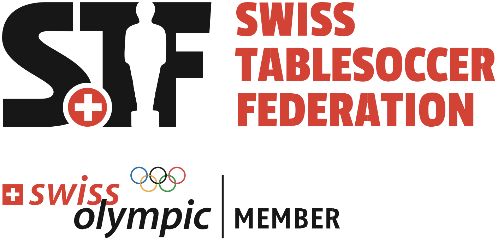

# Grassroots Framework - Swiss Table Soccer Federation (STF)

**Date:** June 19, 2026

## Table of Contents
- [Purpose](#purpose)
- [Implementation](#implementation)
- [Commitment](#commitment)

## Purpose

The Swiss Table Soccer Federation (STF) adopts the International Table Soccer Federation (ITSF) Grassroots Strategy and the ITSF Training Booklet as the basis of its grassroots development activities.

The purpose of this framework is to support the development and improvement of table soccer in Switzerland by promoting learning, player progression, coaching, and the sharing of educational resources.

## Implementation

STF follows and promotes the principles and recommendations established by ITSF regarding:

- Learning the fundamentals of table soccer.
- Progressive player development from beginner to advanced levels.
- Access to educational and training materials.
- Development of coaching and mentoring activities.
- Promotion of fair play and sportsmanship.
- Identification and development of talented players.
- Long-term improvement of playing standards.

STF encourages its affiliated clubs, organizers, and members to use the ITSF Training Booklet and related ITSF educational resources as the reference framework for player development activities.

## Commitment

As a member federation of the International Table Soccer Federation, STF supports the objectives of the ITSF Grassroots Strategy and promotes its implementation within Switzerland.

This document serves as the official declaration that STF adopts the ITSF Grassroots Strategy and the ITSF Training Booklet as the foundation of its grassroots development framework.

---
Swiss Table Soccer Federation (STF) | [https://swisstablesoccer.ch](https://swisstablesoccer.ch) | info@swisstablesoccer.ch | Member of [ITSF](https://tablesoccer.org) | Member of [Swiss Olympic](https://www.swissolympic.ch/ueber-swiss-olympic/kontakte/institutionen-finden/mvo-resultate?id=286932)